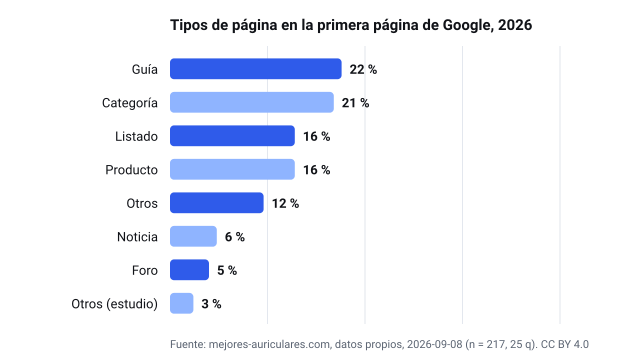
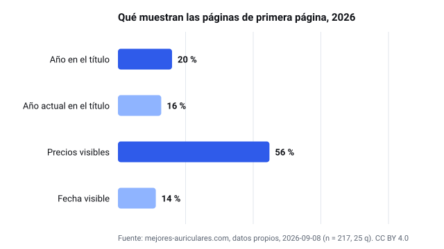
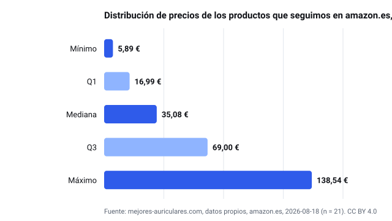
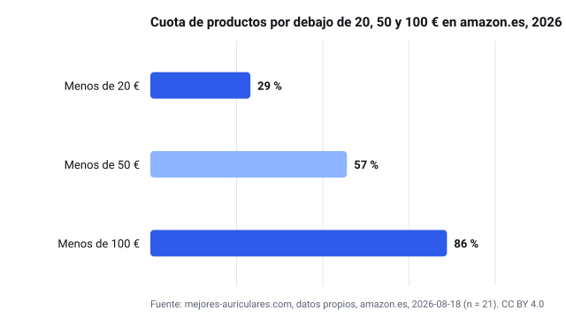

# Electrónica network — open statistics datasets (CC BY 4.0)

Datos propios publicados por los sitios de la red (9 dominios) con licencia [CC BY 4.0](https://creativecommons.org/licenses/by/4.0/): agregados de precios en amazon.es y estudios de primera página de Google. Nunca precios por producto ni texto de terceros. Puedes reutilizar cifras y gráficos citando el sitio con un enlace a su página de estadísticas.

## Conjuntos de datos

### [Estadísticas de auriculares en España 2026](https://mejores-auriculares.com/estadisticas/)

- Página con la versión vigente, el método («Cómo hemos contado») y la caja de cita: **[https://mejores-auriculares.com/estadisticas/](https://mejores-auriculares.com/estadisticas/)**
- Twins en el propio sitio: [https://mejores-auriculares.com/estadisticas/datos/](https://mejores-auriculares.com/estadisticas/)
- Archivos en este repositorio:
  - [prices-2026.csv](mejores-auriculares.com/prices-2026.csv)
  - [prices-2026.json](mejores-auriculares.com/prices-2026.json)
  - [serp-2026.csv](mejores-auriculares.com/serp-2026.csv)
  - [serp-2026.json](mejores-auriculares.com/serp-2026.json)
  - [estudio-serp-2026.svg](mejores-auriculares.com/estudio-serp-2026.svg)
  - [estudio-serp-senales-2026.svg](mejores-auriculares.com/estudio-serp-senales-2026.svg)
  - [precios-2026.svg](mejores-auriculares.com/precios-2026.svg)
  - [precios-tramos-2026.svg](mejores-auriculares.com/precios-tramos-2026.svg)

## Calculadoras gratuitas de la red

Cada una tiene un fragmento «Insertar» con el enlace visible a la fuente.

- [mejores-altavoces.com/herramientas/potencia-y-spl/](https://mejores-altavoces.com/herramientas/potencia-y-spl/)
- [mejores-auriculares.com/herramientas/exposicion-sonora-segura/](https://mejores-auriculares.com/herramientas/exposicion-sonora-segura/)
- [mejores-monitores.com/herramientas/calculadora-ppi/](https://mejores-monitores.com/herramientas/calculadora-ppi/)
- [mejores-moviles.com/herramientas/cuantas-fotos-caben/](https://mejores-moviles.com/herramientas/cuantas-fotos-caben/)
- [mejores-portatiles.com/herramientas/consumo-electrico-portatil/](https://mejores-portatiles.com/herramientas/consumo-electrico-portatil/)
- [mejores-relojes.com/herramientas/ancho-de-correa/](https://mejores-relojes.com/herramientas/ancho-de-correa/)
- [mejortablets.com/herramientas/pulgadas-a-cm/](https://mejortablets.com/herramientas/pulgadas-a-cm/)
- [movilesbarato.com/herramientas/cuota-vs-contado/](https://movilesbarato.com/herramientas/cuota-vs-contado/)
- [televisores-baratos.com/herramientas/distancia-pulgadas/](https://televisores-baratos.com/herramientas/distancia-pulgadas/)

## Licencia y cita

CC BY 4.0. Atribución: «<nombre del sitio> — <URL de la página de estadísticas>». Cada CSV lleva una fila por métrica (`metric,value,n,unit,retrievedAt,method`); cada JSON es el agregado completo con el método y la fecha de la instantánea. Los gráficos SVG se generan a partir de estos archivos, nunca de la prosa.
